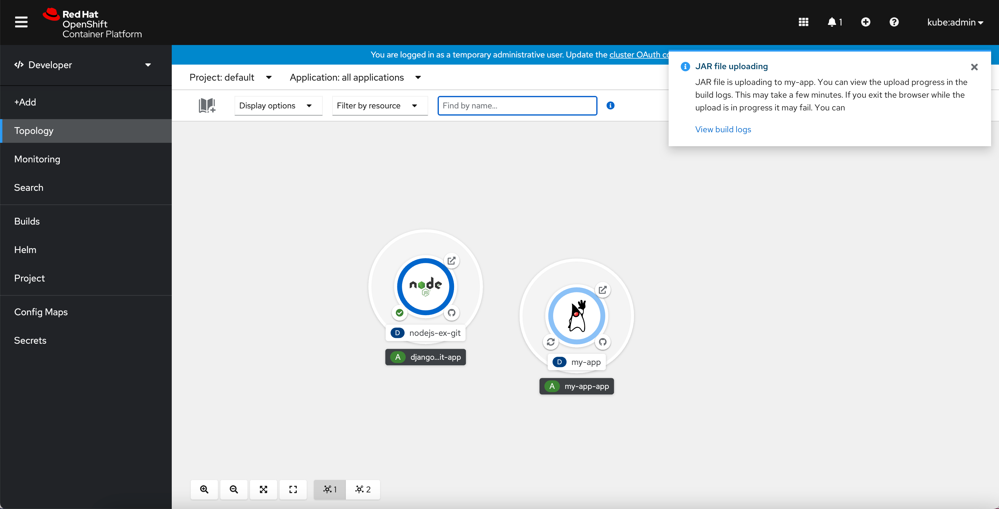
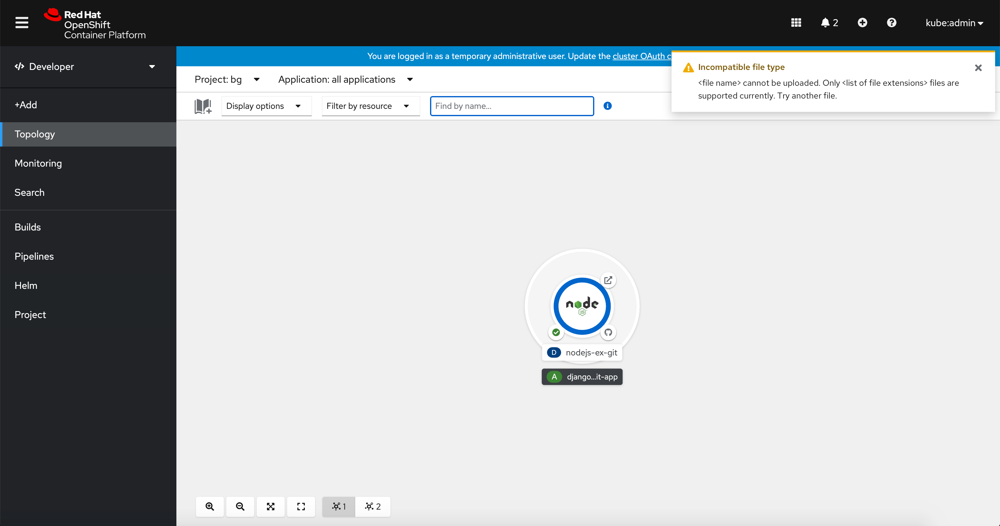

# Toast notifications

Toast notifications can be used to convey important messages or updates to the user regardless of where they are in the console. They should be used sparingly in the OpenShift console.

## Guidelines
### When to use

* To convey console related alerts that appear as a result of the user taking an action in the UI
* To convey status about longer running actions like:
  * A file being uploaded to Topology
  * Something being updated
  * Data being migrated
* To provide status messaging for a user-initiated process that is asynchronous
* To show error messages related to actions taken in the UI

### When not to use

* Toast notifications should not be used as Alertmanager notifications. Alertmanager notifications should be used for persistent cluster related alerts
* User actions that provide immediate feedback, like adding labels or annotations for a single resource where you see the label or annotation get added within the modal
* As a replacement for inline alerts that happen within a form view

## Examples
### Longer running actions

A toast notification is used to provide the user with more information about a longer running action.

### Errors happening

A toast notification is used in this example to alert the user that the file type that they tried to drag and drop is incompatible so it caused an error.

The types of errors that produce a toast notification should be limited and vetted.

### Update available and a refresh is needed

A toast notification prompts the user to refresh their browser/console after an update has been completed.
