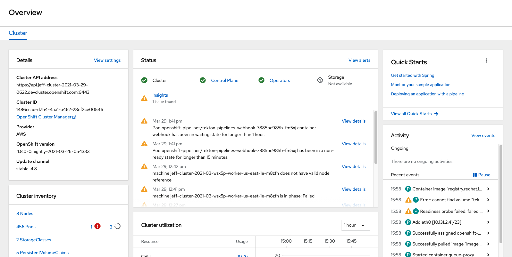
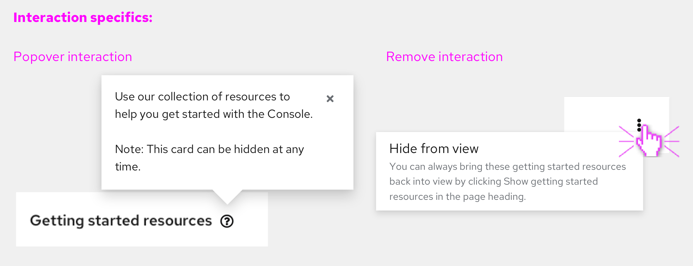
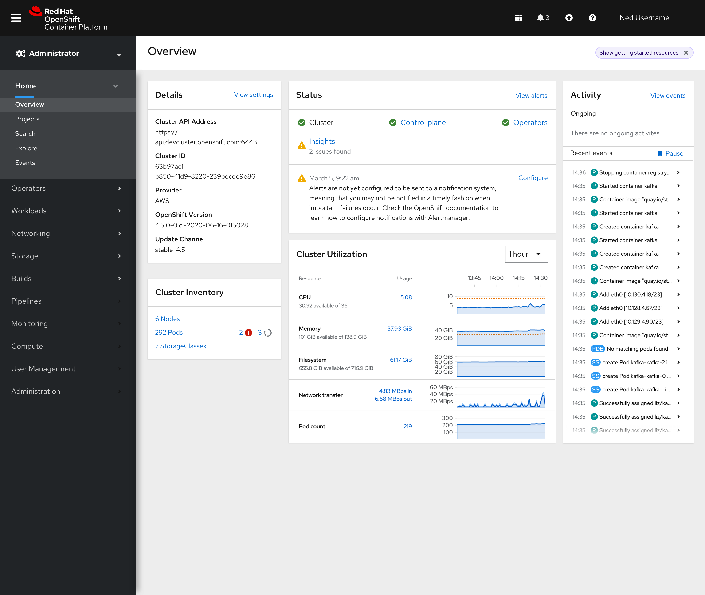

# Getting started card

## Background
A quick starts card exists today on the following landing pages for the Admin and Developer perspectives with the goal to help users learn and use resources in the Console.

- Admin Cluster Overview dashboard

- Developer Add page 

## Goal
As our getting started efforts expand, we realize that we can capture more than just quick starts to help users get started. The goal of this larger Getting Started card is to supply users with many different pathways to learn and use resources in the Console. This card will replace the existing quick start card on both the Add page and Cluster Overview.

## Card design and interactions
The design of the card will remain consistent on the Admin and Developer perspectives, but the content within each column will vary. The reason for this is because there is featured content we would like users to see depending on the perspective they land on.

A popover next to the card title will explain more about what "Getting Started" means in this context. The card should also be able to be hidden, considering there are going to be users who do not want to see it. 

### Content guidance

There should be no more than two items per category, in an attempt to not completely overwhelm the user. Each item is (and should be) actionable, no matter the users' permissions. The link text at the bottom should be sending the user to a more general space for that category. For example, "Build with guided documentation" lists out quick starts. We added a "View all quick starts" link at the bottom to send the user to our quick start catalog page so that they can see all that exist.

### Hiding and adding the card

A kebab in the top right corner of the card will allow the user to hide the card.

Once the card is hidden, a label will appear in the page header, allowing the user to bring it back. This label acts more as a "hint" and is dismissible itself, in case the user has zero interest in seeing anything getting started related.

Selecting the label will bring the card back onto the dashboard.

### Responsiveness

PatternFly has a card demo with this type of layout used within a horizontal card that can be accessed [here](https://www.patternfly.org/v4/components/card/html-demos/horizontal-grid-expanded/). The tablet and mobile views should follow what is shown in that demo, which is the same as below.

## Future design considerations

When iterating on this design for future releases, we should think about the following:
- Refreshing content based on new releases (for example, new features to list on the card depending on what OpenShift version you are using)
- Make a broader getting started catalog page (this is something that could live in the help menu and allow our getting started content to expand much farther)
- Allowing for more user customization of the content on the card (include some sort of survey to capture the users' interests and display that content on the card AND/OR allow for admin customization of what is shown on the card)

