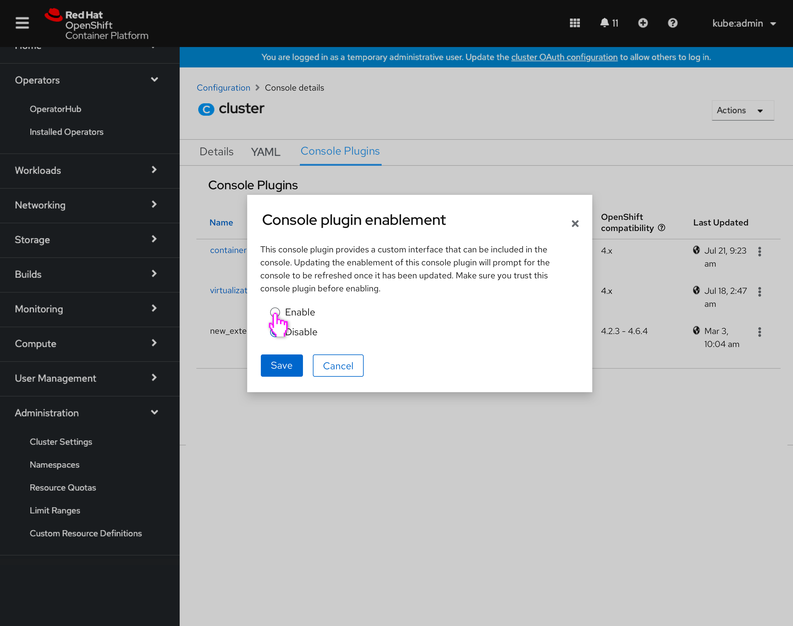
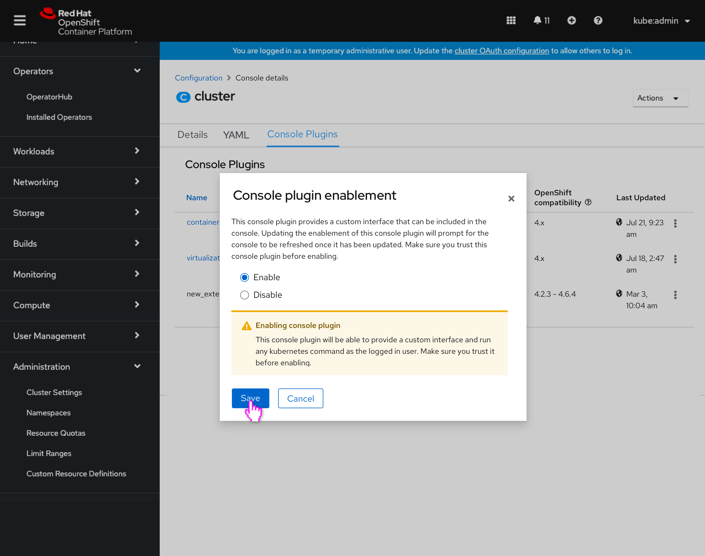
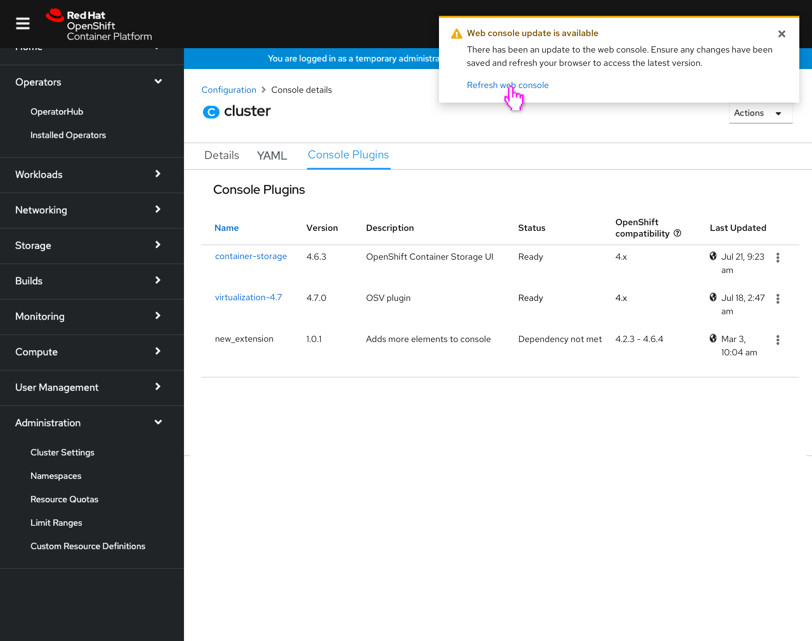

# Allow managing dynamic plugins in Cluster Settings

Users are now able to interact with dynamic plugins that can be contributed by operators or that are included with the console. They should have a way to manage any dynamic plugins on the cluster from within Cluster Settings. They can also use this location to check on the statuses of any plugins to confirm they are operating as intended.

When enabling or disabling a dynamic plugin, the user will need to be prompted to refresh their console to see the updated UI settings.

## Enabling/disabling dynamic plugins from cluster settings

- Because the enablement of dynamic plugins happens on the Console operator configuration resource Console [operator.openshift.io/v1], there will now be a way to access this resource in Cluster Settings (previously only global configuration resources Console [config.openshift.io/v1] were shown).
- A new column will be added to the Configuration tab (formerly Global Configuration) that links to the equivalent operator configuration resource for each item (as available.)
- Resources badges should be added to both columns to better convey that these are (different) resources.

- Column header help should be added to the two columns to help the user better understand what the purpose is for each resource.
- Global popover text: Global configuration resources (config.openshift.io) generally affect other components.
- Operator popover text: Operator configuration resources (operator.openshift.io) generally affect only this cluster operator.

- The Console operator configuration resource is shown.
- The breadcrumb for operator configuration resources returns the user to the Configuration tab.
- A new “Console Plugins” tab is present for surfacing the dynamic plugins.

- The Console Plugins tab lists out the various dynamic plugins on the cluster, including those associated with an operator and those that are not.
- Columns include the dynamic plugins’ name, version, description, status, versions of openshift it is compatible with in semver format, and when it was last updated.
- Users will be notified of dynamic plugins that fall out of the supported openshift version range at cluster upgrade time in a future console feature.

- The OpenShift compatibility column includes inline help to describe that it is in semver format.
- Popover text: Versions of OpenShift in semver format the console plugin is compatible with.

- The action menu for each plugin will only contain a single action “Enable” for disabled plugins and “Disable” for enabled. Both actions launch the ‘Console plugin enablement’ modal.

- When a plugin is disabled, it’s status is clickable and launches a popover that also allows for accessing the ‘Console plugin enablement’ modal.

- The console plugin enablement modal is similar to what is seen in the operator details, and allows the user to enable/disable the plugin.
- Modal text: This console plugin provides a custom interface that can be included in the console. Updating the enablement of this console plugin will prompt for the console to be refreshed once it has been updated. Make sure you trust this console plugin before enabling.

- When enabling the plugin, an inline alert is shown to alert the user that they should trust this plugin.
- Alert text: This console plugin will be able to provide a custom interface and run any kubernetes command as the logged in user. Make sure you trust it before enabling.

- Upon enabling or disabling the plugin, the user can see the status change.

- Once the plugin enablement has updated, any user with a console open would see a toast notification alerting them that their console has updated, and that they should refresh.
- The toast includes a link to refresh the browser/console.
- Toast text: There has been an update to the web console. Ensure any changes have been saved and refresh your browser to access the latest version. 

- All plugins associated with operators have their name value be a clickable link.

- The name link will link the user to the details for that operator.